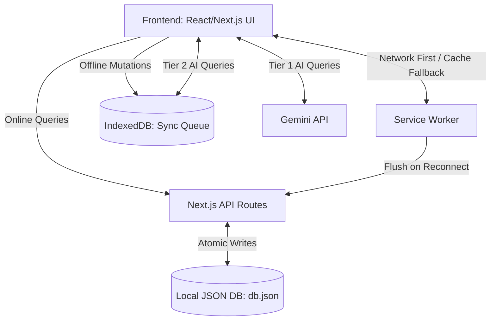

# Celine: The Digital Khata for Indian Vendors 🇮🇳

Celine is a highly-resilient, offline-first Point-of-Sale (POS) and Customer Relationship Management (CRM) system built specifically to empower MSMEs and street vendors in India. 

It tackles the unique challenges of local commerce directly out of the box, offering robust **Udhar (Credit) tracking**, crash-safe data integrity, hands-free voice navigation, and a bespoke "Ink and Paper" visual identity tailored for the streets.

## 📖 About Celine

Celine was conceived to bridge the digital divide for millions of unorganized sector retailers in India. While modern SaaS products assume stable 5G connections and English fluency, real-world Indian street vendors operate in crowded, low-bandwidth environments with unique business models like high-trust credit (Udhar). 

Celine provides a familiar "Digital Khata" (Ledger) experience that respects the realities of street commerce. By combining cutting-edge Web APIs (Service Workers, IndexedDB, Speech Recognition) with a fallback AI architecture, it delivers enterprise-grade reliability and intelligence without the enterprise learning curve.


## 🚀 Core Features

### 1. Hardened Offline-First Architecture
*   **Zero-Downtime Billing**: Powered by a Service Worker and IndexedDB, Celine allows vendors to continue billing, adding customers, and managing inventory even when their mobile network drops completely. 
*   **Smart Sync Queue**: Offline actions are queued locally. Once the network returns, a background sync automatically flushes data to the server, complete with partial-failure retries and collision-resistant offline IDs.
*   **Crash-Safe Data Integrity**: On the backend, `db.json` is updated using atomic file writes to ensure that sudden crashes or power losses never result in corrupted or truncated databases.

### 2. Tailored "Digital Khata" Experience
*   **Ink & Paper Aesthetics**: Celine ditches generic SaaS designs for a bespoke ledger visual language. It features an Ink (`#14171F`) background, Ledger-ruled dividers, and Marigold (`#E8A33D`) and Jade (`#4FA88F`) highlighter accents.
*   **Premium Typography**: Built using Google Fonts (`Fraunces` for headers, `Inter` for UI, and `IBM Plex Mono` for all financial figures) to create a highly readable, premium feel.
*   **Thermal Receipt Printing**: Seamless integration with thermal printers. Receipts are printed using a monospaced, 300px constrained layout that works flawlessly both online and offline, resolving race conditions with native browser print events.

### 3. AI & Voice Accessibility
*   **Hands-Free Voice Navigation**: Vendors can navigate the app completely hands-free using native web speech recognition in English or Hindi (e.g., "Open Khata", "Check Udhar").
*   **Offline-Capable AI Assistant**: A tiered AI system uses Gemini 1.5 Flash for complex Q&A when online. When offline, it gracefully falls back to a local rule-based engine to instantly answer critical business questions ("Who owes me money?", "What is low in stock?").

### 4. Business Growth & Intelligence
*   **Yojana Sahayak (Scheme Assistant)**: An integrated matching engine that checks a vendor's profile against government schemes (PM SVANidhi, PM Vishwakarma) to help them secure micro-loans and subsidies.
*   **Local Demand Spotter**: Analyzes current dates (Monsoons, Diwali, Dussehra) and alerts vendors to expected seasonal demand spikes, prompting timely inventory restocking.
*   **WhatsApp Reminders**: Bulk send Udhar payment reminders and promotional offers directly to customers via WhatsApp templates.

## 🏗️ Architecture

Celine is built on the Next.js App Router (v15), using a zero-dependency JSON approach for rapid deployment without complex cloud setups.



## 🔮 Future Roadmap

*   **Sync Conflict Resolution**: Currently, a "last write wins" strategy applies when syncing. Future updates should implement a more robust merging strategy (e.g. CRDTs or timestamp-based merging) to prevent accidental data overwrites in multi-device setups.
*   **Multi-Tenant Database Migration**: Transitioning from a single `db.json` file to a proper managed database (like Postgres or Firebase) to support multi-vendor authentication and scale securely.
*   **Analytics Telemetry**: Implementing anonymous usage tracking to better understand how vendors interact with the offline features in the field.

## 🛠️ Quick Start

1. Install dependencies:
   ```bash
   npm install
   ```
   *(Note: Celine uses Recharts and React-Window. If you encounter peer dependency issues, use the `--legacy-peer-deps` flag).*

2. Start the development server:
   ```bash
   npm run dev
   ```

3. Open [http://localhost:3000](http://localhost:3000) in your browser. Login as Owner with PIN `1234`.
