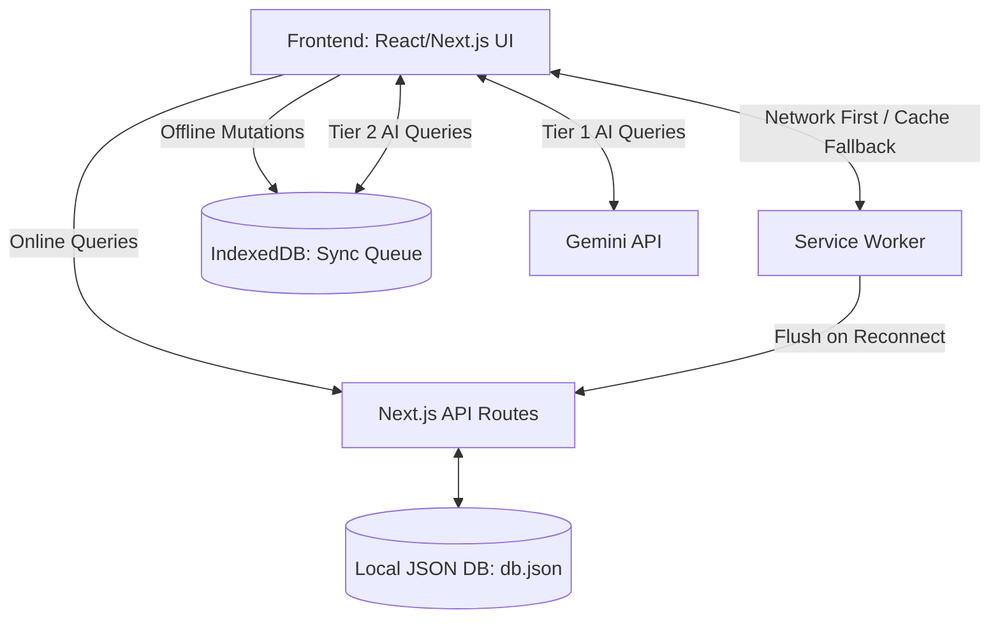

# Celine V2: The AI-Powered CRM for Indian Businesses 🇮🇳

Celine is an offline-first, highly-localized CRM and Point-of-Sale (POS) system built specifically to empower MSMEs and street vendors in India. 

It tackles the unique challenges of local commerce, such as **Udhar (Credit) tracking**, seasonal demand spotting, and language barriers, directly out of the box.

## 🚀 Key Impact & Features

*   **Offline-First Reliability**: Powered by a Service Worker and IndexedDB, Celine allows vendors to continue billing and managing inventory even when their mobile network drops. Background sync automatically flushes data to the server when reconnected.
*   **Voice Navigation**: Vendors can navigate the app completely hands-free using native web speech recognition in English or Hindi (e.g., "Open Inventory", "Check Udhar").
*   **Yojana Sahayak (Scheme Assistant)**: An integrated matching engine that checks a vendor's profile against government schemes (PM SVANidhi, PM Vishwakarma) to help them secure micro-loans and subsidies.
*   **Local Demand Spotter**: Analyzes current dates (Monsoons, Diwali, Dussehra) and alerts vendors to expected seasonal demand spikes, prompting timely inventory restocking.
*   **Offline-Capable AI Assistant**: A tiered AI fallback system. When online, it uses Gemini 1.5 Flash for complex Q&A. When offline, it falls back to a rule-based engine to instantly answer critical questions ("Who owes me money?", "What is low in stock?") using local data.

## 🏗️ Architecture

Celine is built on the Next.js App Router, using a zero-dependency JSON approach for rapid deployment without complex cloud setups.



## 🔮 Future Considerations

*   **Sync Conflict Resolution**: Currently, if the same invoice/customer is edited offline on two devices, a "last write wins" strategy applies when they re-sync. Future updates should implement a more robust merging strategy (e.g. CRDTs or timestamp-based merging) to prevent accidental data overwrites in multi-device setups.
*   **Schemes Data Verification**: The scheme eligibility rules in `lib/schemes.js` can become stale as government policies change. The UI includes a disclaimer to verify against official portals, but future enhancements could ping an external registry or API to keep scheme data fresh.

## 🛠️ Quick Start

1. Install dependencies:
   ```bash
   npm install
   ```
   *(Note: Celine uses Recharts. If you encounter proxy/network issues installing dependencies, use the `--legacy-peer-deps` flag or try a different network).*

2. Start the development server:
   ```bash
   npm run dev
   ```

3. Open [http://localhost:3000](http://localhost:3000) in your browser. Login as Owner with PIN `1234`.
